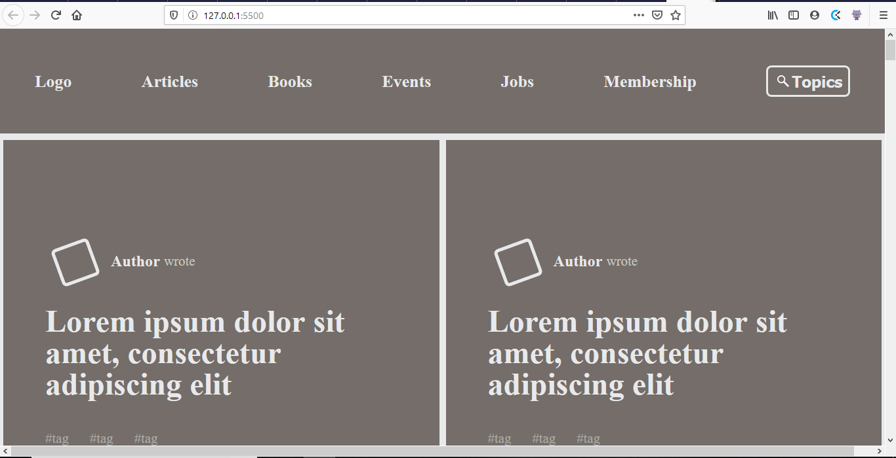

# Smashing Magazine Design Teardown

> We built a heatmap of the Smashing Magazine website, showing how the areas stood out relative to each other using a grayscale palette.

This project was all about figuring out what makes Smashing Magazine tick. We were using CRAP (Contrast, Repetition, Alignment, and Proximity) principles. We were looking for different applications of these principles and reproducing them in our study of the site. I guess that's why it's called a 'teardown'. 

For example, there were particular areas that just naturally stood out, and I suppose these are the areas that the designers of the webpage wanted users to notice first. This is where the contrast came in. There were also elements that were repeated throughout the page in different places. The profile pic images, for example, were litle tilted squares, and they maintained that design anywhere they existed. The images in the call-to-action divs, like the "Smashing TV" one, were also pretty similar, and we represented with the same circular divs. 

The alignment aspect was also quite ubiquitous. Everything had a regular grid arrangement with neat lines everywhere. We tried to reproduce that too. As for proximity, there was an evident grouping of similar content. The latest articles were in one place, the community links were in another, the curated posts were also together, and so on. Here we just mimicked the arrangement of the page with repeating designs and proximity to show groups of content that were together. 

Overall, it was really fun as we got to really dig in and apply the UX/UI principles we had been reading about in the curriculum. We also got the opportunity to solve lots of coding problems in the process and learn new aspects of CSS. The challenge was worth it in the end. We learned a lot more than we thought we would from such a simple project. We hope you like what we came up with.

Feel free to check it out and tell us what you think!

## Built With

- HTML5,
- CSS3

## Live Demo

[This one's for development](https://raw.githack.com/AdedayoOpeyemi/Design-Teardown-Smashing/development/index.html)

[This one's for production](https://rawcdn.githack.com/AdedayoOpeyemi/Design-Teardown-Smashing/bdcb5e5d21f50a4f229af1a7fc5fc096c26c5a58/index.html)

For comparison, here's the [archived version](http://web.archive.org/web/20200309074225/https://www.smashingmagazine.com/), which we archived in the Wayback Machine. The original Smashing Magazine Homepage is [here](https://www.smashingmagazine.com/).

## Authors

👤 **Ramsey Njire**

- Github: [@RamseyNjire](https://github.com/RamseyNjire)
- Twitter: [@untakenramram](https://twitter.com/untakenramram)
- Linkedin: [Ramsey Njire](https://www.linkedin.com/in/ramsey-njire-51984931/)

👤 **Opeyemi Oyelesi**

- Github: [@AdebayoOpeyemi](https://github.com/AdedayoOpeyemi)
- Twitter: [@oyelesiopy](https://twitter.com/oyelesiopy)
- Linkedin: [Opeyemi Oyelesi](https://www.linkedin.com/in/opeyemioyelesi/)

## 🤝 Contributing

Contributions, issues and feature requests are welcome!

## Show your support

Give a ⭐️ if you like this project!

## 📝 License

This project is [MIT](lic.url) licensed.
